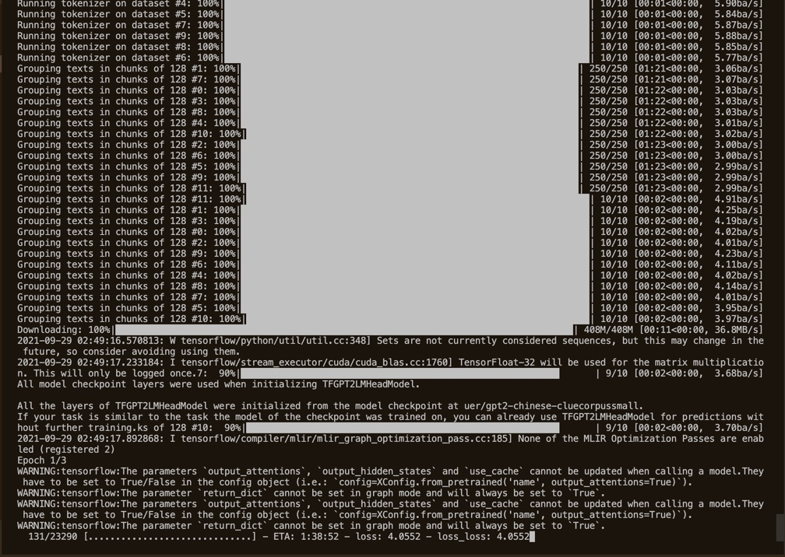

# Finetune_GPT2_Chatbot in Docker
In this repo we create a docker for finetuning the [GPT2 model](https://cdn.openai.com/better-language-models/language_models_are_unsupervised_multitask_learners.pdf)

This project is developed in docker-20.10.7

## preparing ##

git clone this [github](https://github.com/protagolabs/NetMind-TF2)

cd docker_test ( we assume docker_test is the $root directory in following )

## data ##
download preprocessed [train](https://drive.google.com/file/d/1BG7a3ByidHhtI0XVXJyV0pDXBPP87TS2/view?usp=sharing) and [valid](https://drive.google.com/file/d/1Qh6y8HjgG45CKmJKx-vFxaZzv5Ka-PNu/view?usp=sharing) dataset. Put them in $root directory.

## cudnn ##
Download cuDNN v8.2.1 (June 7th, 2021) from [here](https://developer.nvidia.com/rdp/cudnn-archive) to $root directory.

(If you meet difficulty for download the cudnn, please contact me privately.)

tar -xzvf cudnn-11.3-linux-x64-v8.2.1.32.tgz

## build ##

sudo docker build -f Dockerfile -t finetune_gpt2 .

## run docker ##

sudo docker run --runtime=nvidia -ti finetune_gpt2 /bin/bash -c "source activate ml && cd src && python train-tf2.py"

the output training progress should be like the following figure.

## Acknowledgement ##

Thanks for my colleages Xiangpeng Wan and Yu Cheng for their kindly helps
